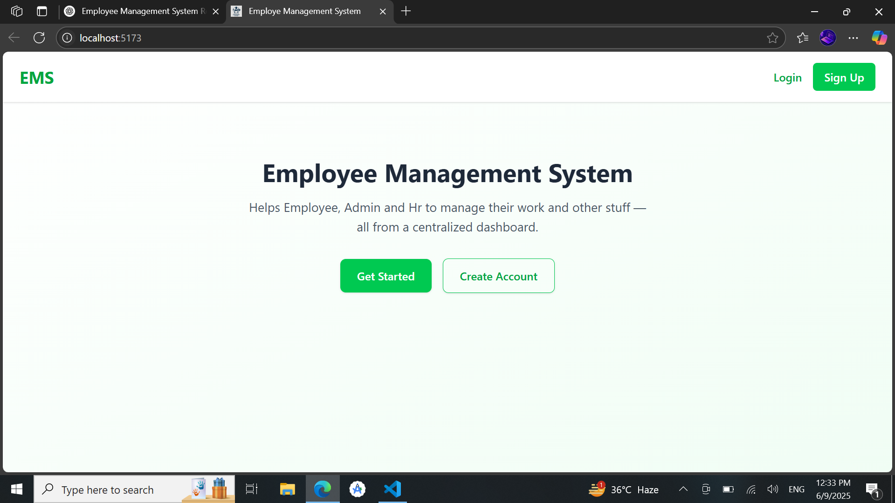

# StaffFlow

StaffFlow is a role-based employee task workspace built with **React**, **Firebase**, and **Tailwind CSS**. Admin and HR users can assign work to employee profiles, while employees only see tasks assigned to their own account.

## Features

- **Authentication:** Firebase email/password and Google sign-in.
- **Password reset:** Firebase reset email fallback from the login flow.
- **Role-aware routing:** Admin/HR and employee dashboards are protected.
- **Employee-specific tasks:** Tasks store `assignedToUid` and employees subscribe only to their assignments.
- **Real-time updates:** Firestore subscriptions power dashboards and task boards.
- **Responsive UI:** Professional StaffFlow interface with consistent alerts, loading states, and actions.

## Tech Stack

- **Frontend:** React.js, Tailwind CSS
- **Backend/Database:** Firebase (Authentication & Firestore)

## Setup Instructions

1. Clone the repository:
   ```bash
   git clone https://github.com/your-username/employee-management-system.git
   cd employee-management-system
